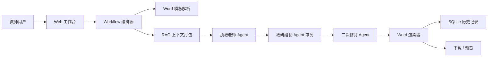
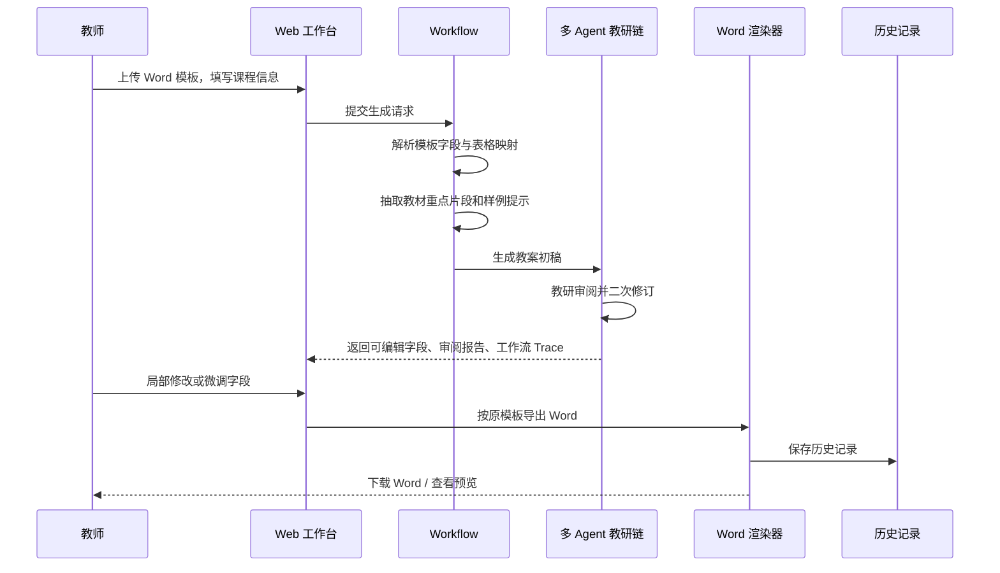
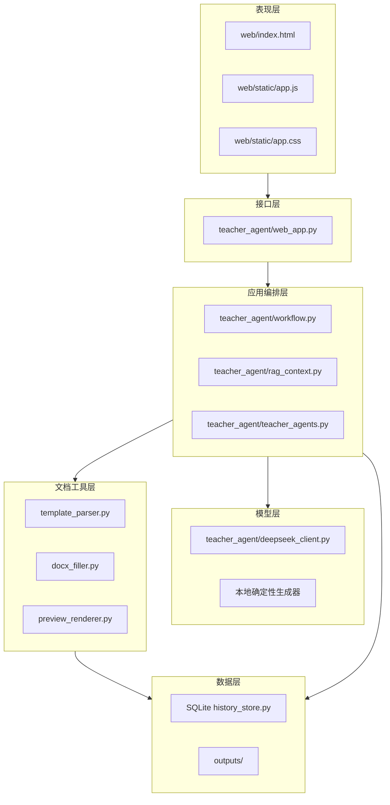

# Teacher_skill V5 Dify-inspired 框架

V5 的目标不是复制 Dify，而是吸收它的核心思想：把一个 AI 应用拆成可配置、可观测、可编排的工作流。教师看到的是一个备课工具，系统内部运行的是一条教育文档生成流水线。

## 总体架构图

## 用户使用流程图

## 工程分层

## 当前已落地模块

- `workflow.py`：V5 工作流编排器，统一返回字段、审阅报告、知识上下文和 Trace。
- `rag_context.py`：轻量 RAG 骨架，先基于教材文本做重点片段抽取，后续可替换为 Chroma、FAISS 等向量库。
- `teacher_agents.py`：多 Agent 教研链，包括执教老师生成、教研组长审阅、二次修订。
- `lesson_generator.py`：支持模板字段反向驱动生成，遇到 `warm_up`、`safety_precautions` 等自定义占位符时会自动补充字段内容。
- `history_store.py`：SQLite 历史记录，保存最近导出的教案、下载链接和工作流 Trace。
- `web_app.py`：新增 `/api/workflow-schema` 和 `/api/history`，生成/导出接口接入 V5 工作流。
- Web 页面：新增框架链路、教研审阅结果和最近导出记录。

## 后续升级路线

P0：把当前 V5 骨架跑稳定，确保 Word 模板格式不被破坏。  
P1：把 `rag_context.py` 替换为真实教材库检索，支持 PDF/OCR/图片教材。  
P2：将 `web_app.py` 迁移到 FastAPI，引入 SSE 流式输出。  
P3：扩展大单元教学、PPTX 生成和班级/教师账号体系。  
